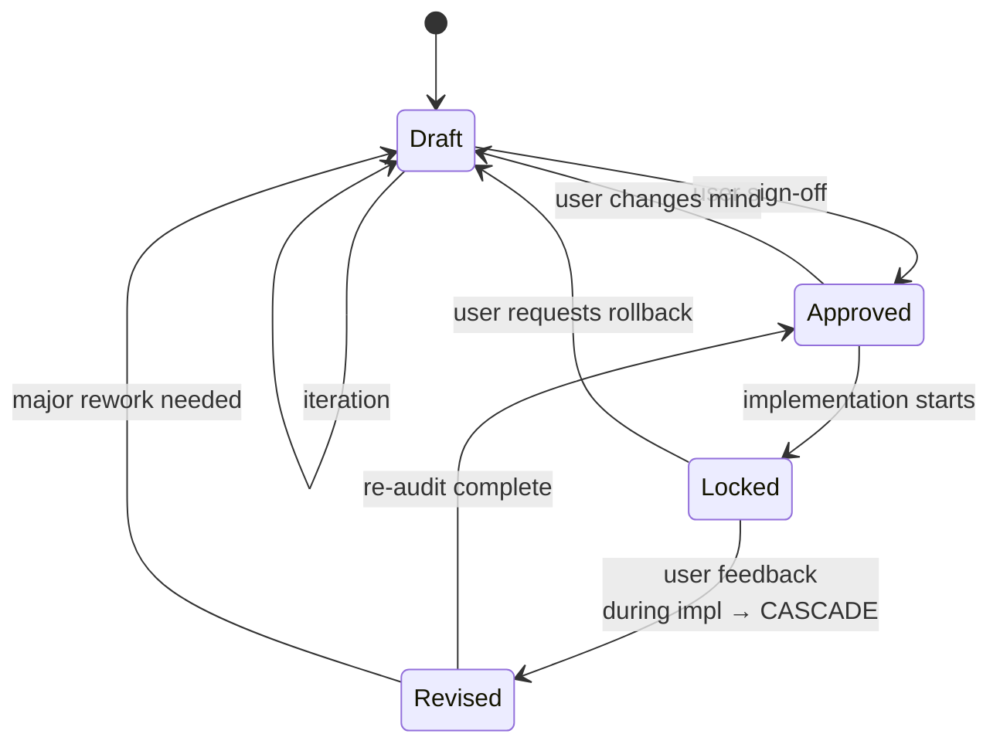

# SPEC Format (`front-end-design-spec.md`)

The format of the Visual Source of Truth artifact. Structure is **Anchor → Serve → Boundary → Output**: § 1 is the anchor, § 2–5 serve it, § 6 is the boundary, § 7 is the output. Capture § 1 before any visual decision; verify § 6 before anything ships.

```markdown
# Front-End Design Specification: [System / Product Name]

> **Status:** `Draft` (see Lifecycle for transitions)
> **Last Revised:** YYYY-MM-DD
> **Revision Count:** N

---

## 1. Brand Mental Model & Differentiation Moat  *(The Anchor — fill FIRST)*
- **Brand Personality** (3-5 adjectives that define behavior): ...
- **Emotional Truth** (what the user should FEEL): ...
- **Brand Moat** (the uncopyable signature — defensible against competitors who would ship the same generic design): ...
- **2nd/3rd Idea Commitment** (the non-obvious choice deliberately made instead of the commodity solution): ...
- **Visual Anti-Patterns** (clichés explicitly rejected — drawn from `brand-design-guidelines.md`): ...

---

## 2. Brand Material & Surface Feel Signature  *(Serves the Moat)*
- **Inferred Brand Texture**: [Surface material matching the moat, not generic decoration]
- **Surface Material Effects**: [Specular, blur, grain, refraction — consistent with personality]
- **Sensory & Tactile Physics**: [Spring dynamics, hover, feedback — must feel "of the brand"]

---

## 3. Calculated Spatial Pacing & Information Flow Control  *(Serves the Moat)*
- **Spatial Rhythm**: [Section padding, container widths, grid gaps — each traced to a personality adjective and a why]
- **Focal Isolation Strategy**: [One primary focal per viewport]
- **Cognitive Assimilation Controls**: [Grouping, hierarchy, negative space]

---

## 4. Opinionated Typography & Token Palette  *(Serves the Moat)*
- **Display Font**: [Name] (weights, stylistic sets, spacing) — expresses brand personality
- **Body Font**: [Name] (line-height, kerning) — legible + branded
- **Color Tokens**: Surface, text, accent, high-contrast focus — carry brand emotion

---

## 5. Technical Front-End Extensions & Shader Moat  *(Serves the Moat — or skipped)*
- **WebGL / Canvas**: [Bespoke shader layer — only if the moat requires it]
- **Physics & Scroll**: [Engine, triggers, cursor reactivity]
- **Performance & A11y Isolation**: [How canvas is isolated from DOM/keyboard/screen-reader]

> If the context does not warrant extensions (e.g., data-dense dashboard), mark this section
> `[Moat via Micro-Interactions]` and focus on precision spring physics instead.

---

## 6. Form-Function Equilibrium & UX 101 Contract  *(The Non-Negotiable Boundary — verify LAST)*

The brand expression above may be opinionated. This section may not be violated. No aesthetic, however branded, breaks these:

- **Accessibility**: WCAG AA contrast min (AAA where feasible); full keyboard nav; screen reader semantics; `prefers-reduced-motion` respected; focus indicators visible.
- **Readability**: Body 16px+, line-height 1.5+, line length 50-75ch; hierarchy clear without color; link text distinguishable.
- **Ease of Navigation**: Wayfinding obvious in 3s; primary action dominant per screen; clear path home; breadcrumbs where depth > 2; search discoverable.
- **Function**: Interactions reliable; errors explicit and recoverable; loading states communicated; no dead ends; back/forward predictable.
- **Low Cognitive Overhead**: One primary focal per viewport; clean component boundaries; no decorative noise; progressive disclosure for complexity.

---

## 7. Top-Fold 3-Second First Impression Plan  *(The Output)*
- **Primary Focal Point**: Hero element that anchors the brand moat
- **3-Second Emotional Target**: What user should FEEL after first viewport
- **Brand Materialization at First Glance**: Which texture/typography delivers the moat immediately

---

## Revision History
> Append-only. One line per status change. **Never edited, only appended.**

- YYYY-MM-DD — Status: `Draft` (initial creation)
```

---

## Spec Lifecycle

Every spec instance carries an explicit Status. Transitions are a state machine:



| Status | Meaning | Can change? |
|---|---|---|
| `Draft` | Active exploration, user feedback expected | Freely |
| `Approved` | User signed off, ready for breakdown | Only error fixes, or revert to `Draft` |
| `Locked` | Implementation in progress | STOP. Cycle to `agentic-dev-loop` for re-scope |
| `Revised` | Updated mid-implementation, cascade triggered | As part of cascade only |

On `Locked` → `Revised`, cascade per SKILL.md: re-open invalidated sub-tasks, re-audit in-progress work, inject corrective sub-tasks into `progress-map.md`, append a Revision History line.